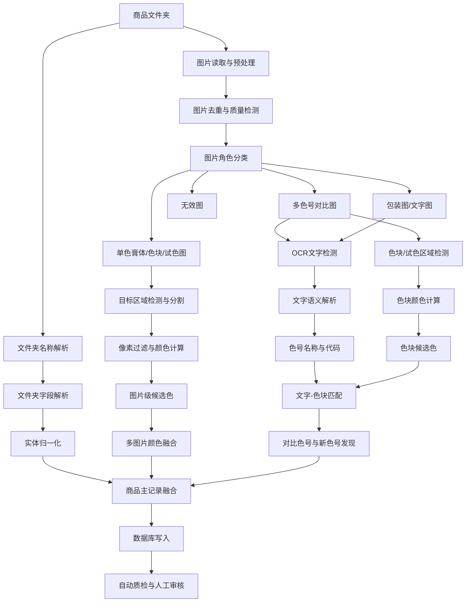

# 口红/唇膏商品代表色提取与色号数据库构建指导方案

## 1. 文档目的

本文档用于指导对 2000+ 个口红、唇膏类商品图片进行自动化处理，完成以下两项核心任务：

1. 为每个商品提取可用于检索、聚类和颜色相似度计算的代表色。
2. 从商品文件夹名称和商品图片中抽取品牌、系列、色号、色号名称、质地、容量、对比色号、色块及其颜色等信息，构建可追溯的商品色号数据库。

本方案强调以下原则：

- 不依赖单一视觉大模型完成全部任务。
- 大模型主要负责语义理解、图片类型判断和结构化关系抽取。
- 传统计算机视觉负责区域分割、像素过滤、颜色计算和颜色相似度。
- OCR 负责批量文字识别及文字坐标提取。
- 所有自动抽取结果必须保留证据来源、图片位置、模型版本和置信度。
- 无证据字段不得由模型自行补全。
- 自动发现的新色号先进入候选表，经过规则验证或人工审核后再进入正式数据库。

---

## 2. 项目目标与产出

### 2.1 商品级产出

每个商品至少输出：

- 品牌；
- 产品系列；
- 商品类别；
- 文件夹原始名称；
- 标准化商品名称；
- 当前商品色号代码；
- 当前商品色号名称；
- 质地；
- 容量；
- 代表色 Hex；
- 代表色 RGB；
- 代表色 Lab；
- 代表色 LCh；
- 颜色来源类型；
- 颜色置信度；
- 多图片颜色离散程度；
- 参与代表色计算的图片列表；
- 是否需要人工审核。

### 2.2 图片级产出

每张图片至少输出：

- 图片角色；
- 是否包含当前商品颜色；
- 是否包含多个色号；
- 是否包含可识别文字；
- 是否适合颜色提取；
- OCR 文字及坐标；
- 色块、膏体、唇部或试色区域；
- 图片质量评分；
- 图片去重哈希；
- 图片向量；
- 图片级候选颜色；
- 图片级抽取证据。

### 2.3 数据库级产出

数据库应支持：

- 商品与色号检索；
- 同一系列色号关系查询；
- 跨品牌颜色相似度查询；
- 对比图中的色号发现；
- 新色号候选管理；
- 图片、文字、色块与结构化字段之间的证据追踪；
- 自动结果与人工修改记录；
- 后续模型训练数据导出。

---

## 3. 术语与定义

### 3.1 代表色

本项目中的代表色不是实验室测得的口红真实物理颜色，而是根据商品图片计算得到的“代表显示色”。

推荐字段名称：

```text
representative_display_hex
representative_rgb
representative_lab
representative_lch
```

代表色主要用于：

- 商品颜色检索；
- 色号聚类；
- 相似色推荐；
- 同系列颜色分布分析；
- 跨品牌替代色号分析。

### 3.2 颜色来源类型

建议统一定义以下来源类型：

```text
official_color_patch
single_product_swatch
lipstick_bullet
lipstick_cut_surface
single_arm_swatch
single_lip_swatch
multi_shade_patch
multi_arm_swatches
multi_lip_swatches
packaging_color
unknown
```

### 3.3 新色号候选

新色号候选是指：

- 当前数据库中不存在；
- 但在商品图、色卡图、对比图或文字宣传图中出现；
- 且可以提取到色号代码、名称、对应色块或部分证据的信息。

新色号候选不能直接写入正式色号表，必须先经过自动交叉验证或人工审核。

---

## 4. 总体系统架构



---

## 5. 推荐技术路线

推荐采用“规则算法 + OCR + 视觉大模型 + 检测分割模型 + 颜色算法”的混合系统。

### 5.1 推荐默认组合

| 模块 | 推荐方法 |
|---|---|
| 图片读取与处理 | Python、Pillow、OpenCV |
| 图片去重 | SHA256、pHash、dHash、视觉向量 |
| OCR | PaddleOCR |
| 图片语义理解 | Qwen-VL 系列视觉语言模型或同等级多模态模型 |
| 开放词汇目标检测 | Grounding DINO |
| 精细区域分割 | SAM 2 / SAM 2.1 |
| 规则色块检测 | OpenCV 轮廓、矩形检测、连通域 |
| 颜色空间转换 | OpenCV、scikit-image、colour-science |
| 颜色聚类 | K-means、Gaussian Mixture、Mean Shift |
| 色差计算 | CIEDE2000，即 ΔE00 |
| 文本归一化 | 规则词典 + 文本模型 |
| 文字-色块匹配 | 空间规则 + 匈牙利算法 |
| 数据库 | PostgreSQL；原型期可使用 SQLite |
| 向量检索 | FAISS、pgvector 或 Milvus |
| 审核界面 | Streamlit、Gradio 或内部 Web 页面 |

### 5.2 不建议的方案

以下方案不建议作为正式系统的核心方法：

- 让视觉大模型直接观察整张商品图并输出唯一 Hex。
- 对整张图片直接计算平均 RGB。
- 只使用文件夹名称，不读取图片文字。
- 只保留最终字段，不保留图片和坐标证据。
- 将不同来源的颜色直接平均。
- 将 OCR 结果直接当成色号名称。
- 将图片中出现的所有数字都当成色号。
- 将模型生成但图片中不存在的信息写入数据库。
- 直接用 Hex 或 RGB 欧氏距离作为最终色号相似度。

---

## 6. 数据输入规范

建议每个商品对应一个独立文件夹。

示例：

```text
dataset/
├── Dior_烈艳蓝金唇膏_999_传奇红唇/
│   ├── 001.jpg
│   ├── 002.jpg
│   ├── 003.jpg
│   └── 004.jpg
├── MAC_Powder_Kiss_923_Stay_Curious/
│   ├── 001.jpg
│   ├── 002.jpg
│   └── 003.jpg
└── ...
```

建议为每个商品建立内部唯一 ID，不直接使用文件夹名称作为主键。

```text
product_id = UUID 或内部自增 ID
```

建议保存：

- 原始文件夹名称；
- 标准化文件夹名称；
- 原始图片文件名；
- 图片相对路径；
- 图片文件哈希；
- 图片感知哈希；
- 图片导入时间。

---

## 7. 第一条流水线：商品代表色提取

## 7.1 图片预处理

对每张图片执行以下步骤：

1. 修正 EXIF 方向。
2. 转换为统一的 sRGB 色彩空间。
3. 删除无法读取或损坏的文件。
4. 记录分辨率、宽高比和文件大小。
5. 计算清晰度。
6. 计算曝光质量。
7. 检测大面积纯白、纯黑或透明区域。
8. 计算 SHA256。
9. 计算 pHash 和 dHash。
10. 生成视觉向量，用于近重复图识别。

### 7.1.1 图片质量指标

建议至少包括：

```text
blur_score
exposure_score
resolution_score
compression_score
usable_area_ratio
overall_quality_score
```

模糊度可使用 Laplacian 方差估计。

曝光问题可通过亮度直方图估计：

- 高亮区域占比过高；
- 暗部区域占比过高；
- 动态范围过窄；
- 大面积过曝或欠曝。

### 7.1.2 图片去重

建议分三级去重：

#### 一级：文件完全重复

使用：

```text
SHA256
```

#### 二级：轻微压缩或尺寸变化

使用：

```text
pHash
dHash
```

#### 三级：裁剪、加字或局部变化

使用：

```text
视觉 Embedding 余弦相似度
```

去重时不要直接删除所有重复图片，应保留：

- 主图片；
- 重复关系；
- 重复类型；
- 原始路径。

---

## 7.2 图片角色分类

每张图片先分类，再决定后续处理方法。

推荐标签：

```text
single_lipstick_bullet
single_lipstick_cut_surface
single_product_swatch
single_arm_swatch
single_lip_swatch
multi_shade_chart
multi_arm_swatches
multi_lip_swatches
packaging_only
text_poster
mixed_product_scene
irrelevant_or_low_quality
```

建议输出：

```json
{
  "image_role": "multi_shade_chart",
  "contains_target_product_color": true,
  "contains_multiple_shades": true,
  "contains_readable_shade_text": true,
  "suitable_for_color_extraction": true,
  "color_source_quality": 0.85,
  "reason": "存在多个独立色块和对应色号文字"
}
```

### 7.2.1 实施建议

初期：

- 使用视觉大模型进行分类；
- 使用固定枚举标签；
- 强制输出 JSON；
- 不允许自由生成类别。

中期：

- 人工审核并积累分类标签；
- 训练轻量图片分类模型；
- 高置信度样本由小模型处理；
- 低置信度样本再调用视觉大模型。

---

## 7.3 颜色来源优先级

建议设置以下基础权重：

| 来源类型 | 基础权重 |
|---|---:|
| 官方规则色块 | 1.00 |
| 独立涂抹色块 | 0.90 |
| 白底膏体切面 | 0.85 |
| 单支膏体主体 | 0.80 |
| 单色手臂试色 | 0.65 |
| 单色唇部试色 | 0.50 |
| 多色号对比色块 | 0.75 |
| 包装颜色 | 0.20 |
| 宣传背景 | 0.00 |

上述数值是初始工程权重，需要通过人工标注集重新校准。

---

## 7.4 目标区域检测

不同图片角色采用不同的检测策略。

### 7.4.1 规则色块

适用于：

- 矩形色卡；
- 圆形色卡；
- 排列整齐的色块；
- 纯色背景中的独立色块。

推荐方法：

- Canny 边缘检测；
- 连通域分析；
- 矩形轮廓检测；
- 圆检测；
- 颜色一致性区域检测；
- 形态学操作；
- 网格结构分析。

### 7.4.2 膏体、试色与唇部区域

适用于：

- 口红膏体；
- 手臂试色；
- 唇部试色；
- 不规则涂抹区域。

推荐流程：

```text
Grounding DINO 检测目标框
        ↓
SAM 生成像素级掩膜
        ↓
规则过滤掩膜边缘和异常区域
```

可使用的检测提示词：

```text
lipstick bullet
lipstick color surface
lipstick swatch
lip color region
painted lip area
arm swatch
color patch
```

### 7.4.3 掩膜质量检测

每个掩膜至少检查：

- 面积是否过小；
- 是否接触图片边界；
- 是否包含大量白色或黑色；
- 是否包含明显皮肤区域；
- 内部颜色是否高度离散；
- 是否与目标框位置一致；
- 是否存在多个不连通区域。

建议输出：

```text
mask_area_ratio
mask_center_score
mask_edge_touch_ratio
mask_color_consistency
mask_quality_score
```

---

## 7.5 掩膜内部颜色计算

### 7.5.1 为什么不能直接平均

膏体和试色区域通常包含：

- 高光；
- 阴影；
- 反射；
- 皮肤；
- 包装；
- 描边；
- 文字；
- 图像压缩噪声。

直接计算平均 RGB 会显著偏离主体颜色。

### 7.5.2 推荐处理步骤

1. 对掩膜进行内缩。
2. 删除边界像素。
3. 将 sRGB 转换为 Lab。
4. 删除亮度过高和过低的像素。
5. 删除低饱和背景像素。
6. 删除接近白色、黑色和灰色的异常像素。
7. 对剩余像素聚类。
8. 识别主体颜色簇。
9. 计算主体簇的 Lab 中位数。
10. 转换为 RGB 和 Hex。

### 7.5.3 掩膜内缩

建议将掩膜向内腐蚀约 3% 到 8%。

对于小目标，应使用较小腐蚀核。

对于规则矩形色块，可以直接取中心区域，例如：

```text
中心 60% 到 80% 区域
```

### 7.5.4 亮度过滤

在 Lab 色彩空间中，可删除 L 值最高和最低的部分像素。

初始可使用：

```text
删除最低 5% 到 10%
删除最高 5% 到 10%
```

具体比例需要根据人工样本调整。

### 7.5.5 颜色聚类

推荐使用：

- K-means：速度快，适合大规模；
- Gaussian Mixture：适合颜色分布重叠；
- Mean Shift：不需要预先指定簇数，但速度较慢。

建议初始设置：

```text
K = 3 到 5
```

可能的簇包括：

- 主体色；
- 高光；
- 阴影；
- 背景残留；
- 皮肤残留。

### 7.5.6 主体颜色簇选择

不能简单选择像素最多的簇。

可综合以下因素：

```text
cluster_score =
面积权重
× 中心位置权重
× 饱和度权重
× 亮度合理性
× 空间连续性
× 来源类型权重
```

主体簇应满足：

- 面积较大；
- 位于目标区域内部；
- 不属于极亮或极暗；
- 颜色饱和度合理；
- 空间位置连续；
- 与周围像素一致。

### 7.5.7 图片级输出

```json
{
  "image_id": "img_0032",
  "source_type": "single_product_swatch",
  "hex": "#9C3D4E",
  "rgb": [156, 61, 78],
  "lab": [41.7, 40.2, 12.9],
  "lch": [41.7, 42.2, 17.8],
  "mask_quality": 0.94,
  "source_weight": 0.90,
  "exposure_quality": 0.88,
  "pixel_consistency": 0.91,
  "color_confidence": 0.84
}
```

---

## 7.6 多图片颜色融合

同一商品可能包含多个候选颜色，不能直接对 Hex 求平均。

### 7.6.1 图片级总权重

推荐：

```text
image_color_weight =
source_type_weight
× mask_quality
× image_quality
× exposure_quality
× pixel_consistency
× target_identity_confidence
```

### 7.6.2 离群值识别

步骤：

1. 将所有候选颜色转换为 Lab。
2. 计算两两 ΔE00。
3. 计算每个候选色到其他候选色的平均距离。
4. 删除与多数颜色差异过大的候选。
5. 检查是否存在两个明显颜色簇。

如果存在两个明显颜色簇，可能意味着：

- 文件夹中混入其他色号；
- 存在薄涂和厚涂两种表现；
- 商品图使用了不同滤镜；
- 某些图片提取到了包装而非内容物；
- 当前商品身份识别错误。

### 7.6.3 代表色选择

推荐选择加权 medoid：

- 候选色必须来自真实图片；
- 与其他高权重候选色的总距离最小；
- 相比直接取加权均值，更容易追溯到真实证据图片。

### 7.6.4 商品级输出

```json
{
  "product_id": "P000123",
  "representative_hex": "#9A3E4E",
  "representative_rgb": [154, 62, 78],
  "representative_lab": [41.3, 39.5, 12.1],
  "representative_lch": [41.3, 41.3, 17.0],
  "color_confidence": 0.87,
  "color_dispersion_de00": 3.6,
  "source_count": 4,
  "primary_source_type": "single_product_swatch",
  "primary_image_id": "img_0032",
  "requires_review": false
}
```

### 7.6.5 初始审核阈值

| 多图片离散程度 | 建议处理 |
|---|---|
| ΔE00 ≤ 3 | 高度一致 |
| 3 < ΔE00 ≤ 6 | 基本可接受 |
| 6 < ΔE00 ≤ 10 | 建议复核 |
| ΔE00 > 10 | 强制人工审核 |

阈值必须在项目金标准数据上重新校准。

---

## 8. 第二条流水线：商品与色号信息抽取

## 8.1 文件夹名称解析

文件夹名称是高价值结构化信息来源。

可能包含：

- 品牌；
- 系列；
- 商品名称；
- 色号代码；
- 色号名称；
- 质地；
- 容量；
- 包装类型；
- 平台 SKU；
- 店铺自定义信息。

示例：

```text
Dior迪奥烈艳蓝金唇膏 999 传奇红唇 哑光 3.5g
```

目标输出：

```json
{
  "brand_raw": "Dior迪奥",
  "brand_normalized": "Dior",
  "product_line_raw": "烈艳蓝金唇膏",
  "product_line_normalized": "Rouge Dior",
  "category": "lipstick",
  "shade_code": "999",
  "shade_name_zh": "传奇红唇",
  "shade_name_en": null,
  "finish": "matte",
  "net_content": 3.5,
  "net_content_unit": "g"
}
```

### 8.1.1 推荐两阶段解析

#### 阶段一：规则解析

使用：

- 品牌词典；
- 系列词典；
- 质地词典；
- 容量正则；
- 色号格式正则；
- 中英文分隔规则；
- 商品类别词典。

#### 阶段二：语言模型归一化

用于：

- 判断数字是色号、容量还是型号；
- 区分系列名称和色号名称；
- 识别中文、英文或日文别名；
- 将近义质地词映射到统一标签；
- 将不规则文本转换为固定 JSON。

### 8.1.2 原始值与标准值并存

数据库中应同时保存：

```text
raw_value
normalized_value
normalization_method
normalization_confidence
```

不要覆盖原始文件夹名称。

---

## 8.2 OCR文字抽取

OCR 用于识别图片上的：

- 品牌；
- 产品系列；
- 色号代码；
- 色号名称；
- 色卡标签；
- 质地；
- 容量；
- 宣传描述；
- 对比色号；
- 使用说明。

建议保留完整 OCR 结果：

```json
{
  "text": "N12 ROSEWOOD",
  "normalized_text": "N12 ROSEWOOD",
  "bbox": [123, 355, 286, 397],
  "ocr_confidence": 0.96,
  "image_id": "img_0098"
}
```

必须保留文字坐标，因为后续需要建立文字和色块的空间关系。

### 8.2.1 OCR处理流程

```text
原图
  ↓
方向检测
  ↓
文字区域检测
  ↓
文字识别
  ↓
文字行合并
  ↓
多语言标准化
  ↓
坐标保留
```

### 8.2.2 OCR后处理

包括：

- 全角半角统一；
- 大小写统一；
- 常见字符混淆纠正；
- `O` 与 `0`；
- `I`、`l` 与 `1`；
- 破折号与连字符；
- 色号前缀标准化；
- Unicode 规范化；
- 多行文字合并。

---

## 8.3 视觉大模型结构化理解

OCR 只负责识别文字，不负责解释字段含义。

视觉大模型负责：

- 判断图片类型；
- 判断哪些文字是色号；
- 判断哪些文字是色号名称；
- 判断哪些文字属于当前商品；
- 判断哪些属于对比色号；
- 判断文字与哪个色块对应；
- 判断是否存在新色号；
- 判断某区域是否是膏体、色卡、唇部或手臂试色；
- 判断文件夹名称与图片是否一致。

### 8.3.1 输入内容

建议给模型提供：

- 原图；
- OCR 文字及坐标；
- 当前文件夹名称；
- 文件夹初步解析结果；
- 当前数据库已有品牌、系列和色号列表；
- 检测到的色块框或试色框。

### 8.3.2 输出约束

必须使用固定 JSON Schema。

示例：

```json
{
  "image_role": "multi_shade_chart",
  "brand": {
    "value": "MAC",
    "evidence_type": "folder_and_image",
    "evidence_bboxes": [[21, 18, 140, 58]],
    "confidence": 0.98
  },
  "product_line": {
    "value": "Powder Kiss Lipstick",
    "evidence_type": "image_text",
    "evidence_bboxes": [[80, 75, 430, 121]],
    "confidence": 0.91
  },
  "target_shade": {
    "shade_code": "923",
    "shade_name": "Stay Curious",
    "evidence_bboxes": [[102, 420, 260, 458]],
    "confidence": 0.94
  },
  "comparison_shades": [
    {
      "shade_code": "922",
      "shade_name": "Werk Werk Werk",
      "text_bbox": [420, 420, 620, 458],
      "swatch_bbox": [440, 175, 570, 365],
      "relationship_confidence": 0.90
    }
  ],
  "unsupported_fields": []
}
```

### 8.3.3 关键提示词约束

提示词中必须写明：

```text
只抽取图片、OCR结果和文件夹名称中存在明确证据的信息。
没有证据的字段输出 null。
不得依据常识补全品牌、系列、色号或名称。
每个非空字段必须给出证据类型和置信度。
涉及图片文字的字段必须返回对应 bbox。
```

---

## 9. 多色号对比图处理

多色号对比图是发现额外色号和构建系列数据库的关键数据源。

## 9.1 多色号图可能提供的信息

- 当前商品色号；
- 当前商品色号名称；
- 同系列其他色号；
- 其他色号名称；
- 每个色号对应色块；
- 数据库中不存在的新色号；
- 同一系列的完整色卡；
- 色号排序关系；
- 官方或商家对比关系。

## 9.2 色块检测

优先使用规则方法：

- 矩形检测；
- 圆形检测；
- 网格分析；
- 连通域；
- 相似尺寸区域聚类；
- 色带检测。

对于以下情况再使用检测分割模型：

- 手臂多色试色；
- 多个唇部局部图；
- 不规则涂抹区域；
- 色块边缘不明确；
- 色块与背景颜色相近。

## 9.3 文字与色块匹配

匹配依据：

- 水平距离；
- 垂直距离；
- 是否位于同一行；
- 是否位于同一列；
- 阅读顺序；
- 区域尺寸；
- 视觉模型判断；
- 图像整体版式。

可定义：

```text
match_cost =
w1 × horizontal_distance
+ w2 × vertical_distance
+ w3 × row_mismatch_penalty
+ w4 × column_mismatch_penalty
+ w5 × reading_order_penalty
+ w6 × vlm_relation_penalty
```

然后使用匈牙利算法求解一对一匹配。

## 9.4 常见版式

### 版式一：同行色块与名称

```text
[色块] N12 Rosewood
[色块] N18 Berry
```

优先按同行匹配。

### 版式二：色块在上，名称在下

```text
色块1   色块2   色块3
名称1   名称2   名称3
```

优先按列中心匹配。

### 版式三：手臂多色试色

```text
色号列表在一侧
多条试色位于另一侧
```

需要结合：

- 排列顺序；
- 纵向位置；
- 大模型版式判断；
- 人工审核。

### 版式四：多个唇部小图

需要检测每个唇部区域，并匹配附近的色号名称。

---

## 10. 新色号发现机制

## 10.1 候选生成

发现数据库中不存在的色号时，写入候选表。

```json
{
  "candidate_shade_code": "N18",
  "candidate_shade_name": "Berry Rose",
  "candidate_hex": "#8E3748",
  "brand": "Example Brand",
  "product_line": "Example Lipstick",
  "evidence_count": 2,
  "evidence_images": ["img_101", "img_322"],
  "discovery_confidence": 0.88,
  "status": "pending_review"
}
```

## 10.2 自动确认规则

满足以下任一条件时，可进入自动高可信候选：

1. 两张独立图片出现相同色号代码和名称。
2. 文件夹名称与图片文字互相印证。
3. 一张清晰色卡图同时包含品牌、系列、色号和对应色块。
4. 同一品牌系列的多张图片中重复出现。
5. OCR、视觉模型和版式匹配结果一致。
6. 色号代码格式符合该品牌或系列的既有规律。

## 10.3 必须人工审核的情况

- 只有一张模糊图片；
- 色号代码与名称匹配不确定；
- 文字和色块位置关系不清；
- 文件夹名称与图片冲突；
- 品牌或系列不确定；
- 色号可能是营销编号而非正式色号；
- 对比图来自非官方拼图；
- 颜色区域受滤镜或肤色影响明显。

---

## 11. 数据库设计

不建议将所有信息放在一张大表中。

推荐至少包含以下表。

## 11.1 商品表 `product`

```text
product_id
brand_id
product_line_id
category
product_name_zh
product_name_en
finish
texture
net_content
net_content_unit
folder_name_raw
folder_name_normalized
source_platform
source_sku
created_at
updated_at
```

## 11.2 品牌表 `brand`

```text
brand_id
brand_name_normalized
brand_name_zh
brand_name_en
brand_aliases
country_or_region
```

## 11.3 产品系列表 `product_line`

```text
product_line_id
brand_id
line_name_normalized
line_name_zh
line_name_en
line_aliases
category
```

## 11.4 色号表 `shade`

```text
shade_id
product_line_id
shade_code
shade_name_zh
shade_name_en
shade_aliases
representative_hex
representative_rgb_r
representative_rgb_g
representative_rgb_b
representative_lab_l
representative_lab_a
representative_lab_b
representative_lch_l
representative_lch_c
representative_lch_h
color_confidence
color_dispersion_de00
primary_source_type
primary_image_id
status
created_at
updated_at
```

## 11.5 商品与色号关系表 `product_shade`

```text
product_id
shade_id
relation_type
confidence
evidence_id
```

## 11.6 图片表 `image`

```text
image_id
product_id
file_path
filename_raw
sha256
phash
dhash
embedding_id
width
height
image_role
quality_score
contains_text
contains_multiple_shades
suitable_for_color_extraction
created_at
```

## 11.7 图片区域表 `image_region`

```text
region_id
image_id
region_type
bbox
mask_path
detector
segmenter
model_version
region_confidence
mask_quality
```

`region_type`可包括：

```text
lipstick_bullet
lipstick_surface
color_patch
arm_swatch
lip_swatch
text_region
package
background
```

## 11.8 OCR结果表 `ocr_text`

```text
ocr_id
image_id
text_raw
text_normalized
bbox
language
ocr_confidence
ocr_model
ocr_model_version
```

## 11.9 抽取证据表 `extraction_evidence`

```text
evidence_id
image_id
region_id
ocr_id
entity_type
field_name
raw_value
normalized_value
evidence_type
extraction_method
model_name
model_version
confidence
review_status
reviewer
created_at
```

## 11.10 图片候选颜色表 `image_color_candidate`

```text
candidate_color_id
image_id
region_id
source_type
hex
rgb_r
rgb_g
rgb_b
lab_l
lab_a
lab_b
lch_l
lch_c
lch_h
mask_quality
pixel_consistency
exposure_quality
source_weight
color_confidence
is_outlier
```

## 11.11 色号关系表 `shade_relation`

```text
relation_id
source_shade_id
target_shade_id
relation_type
source_image_id
confidence
review_status
```

`relation_type`包括：

```text
same_product_line
shown_together
possible_alias
possible_duplicate
visually_similar
comparison_reference
```

## 11.12 新色号候选表 `shade_candidate`

```text
candidate_id
brand_id
product_line_id
shade_code_raw
shade_code_normalized
shade_name_raw
shade_name_normalized
candidate_hex
candidate_lab
evidence_count
confidence
status
created_at
updated_at
```

---

## 12. 模型选择建议

## 12.1 OCR模型

推荐：

```text
PaddleOCR
```

适合：

- 中文；
- 英文；
- 日文；
- 数字；
- 色号代码；
- 小字号标签；
- 批量离线处理。

需要保留：

- 文字内容；
- 文字框坐标；
- OCR置信度；
- OCR模型版本。

## 12.2 视觉语言模型

推荐选择具备以下能力的模型：

- 图片分类；
- OCR辅助理解；
- 多图理解；
- 空间关系理解；
- JSON结构化输出；
- 中英文处理；
- 可本地部署或可通过 API 调用。

可采用：

```text
Qwen-VL 系列
其他同等级多模态视觉语言模型
```

建议用途：

- 图片角色分类；
- 当前色号判断；
- 对比色号识别；
- OCR字段解释；
- 文字与色块关系判断；
- 文件夹名称与图片一致性判断；
- 新色号候选解释。

不建议用途：

- 直接从整张图输出最终 Hex；
- 替代像素级颜色计算；
- 无证据补充商品信息。

## 12.3 检测模型

推荐：

```text
Grounding DINO
```

适合：

- 开放词汇目标检测；
- 无需提前为所有对象训练专用类别；
- 根据提示词检测膏体、色块、唇部和试色。

## 12.4 分割模型

推荐：

```text
SAM 2 或 SAM 2.1
```

适合：

- 根据检测框生成精细掩膜；
- 分割口红膏体；
- 分割试色；
- 分割唇部区域；
- 辅助生成后续训练数据。

## 12.5 图片向量模型

用途：

- 图片去重；
- 同图裁剪版本识别；
- 同系列色卡图聚类；
- 商品图检索；
- 文本搜索图片。

可采用：

- 通用视觉 Embedding 模型；
- 多模态 Embedding 模型；
- CLIP 类模型；
- Qwen-VL Embedding 类模型。

## 12.6 是否需要训练模型

初始阶段不需要立即训练。

优先直接使用预训练模型完成基线系统。

后续可训练：

1. 图片角色分类器；
2. 口红膏体、色块、试色区域检测模型；
3. 专用分割模型；
4. 文件夹名称实体识别模型；
5. 视觉语言模型 LoRA。

---

## 13. 推荐分级推理策略

为控制成本和提高稳定性，建议采用三级处理。

## 13.1 第一级：规则和廉价模型

对全部图片执行：

- 文件哈希；
- 感知哈希；
- 图片质量检测；
- OCR；
- 文件夹名称规则解析；
- 规则色块检测；
- 简单图片分类；
- 视觉向量生成。

## 13.2 第二级：本地视觉模型

处理：

- 图片角色不确定；
- 是否包含多个色号不确定；
- 是否适合颜色提取不确定；
- 当前商品颜色区域不明确；
- OCR字段类型不明确。

## 13.3 第三级：强视觉模型或人工审核

处理：

- 多色号复杂对比图；
- 文件夹名称与图片冲突；
- 文字与色块关系不明确；
- 发现疑似新色号；
- 多图片颜色差异过大；
- 商品系列不明确；
- 当前色号与对比色号容易混淆。

---

## 14. 推荐项目目录结构

```text
lip_color_pipeline/
├── configs/
│   ├── pipeline.yaml
│   ├── model.yaml
│   ├── color_rules.yaml
│   └── taxonomy.yaml
├── data/
│   ├── raw/
│   ├── interim/
│   ├── processed/
│   ├── masks/
│   ├── crops/
│   └── embeddings/
├── dictionaries/
│   ├── brands.json
│   ├── product_lines.json
│   ├── finishes.json
│   ├── textures.json
│   └── shade_patterns.json
├── src/
│   ├── ingestion/
│   │   ├── scan_folders.py
│   │   ├── image_loader.py
│   │   └── metadata.py
│   ├── preprocessing/
│   │   ├── orientation.py
│   │   ├── quality.py
│   │   ├── hashing.py
│   │   └── deduplication.py
│   ├── classification/
│   │   ├── image_role.py
│   │   └── source_quality.py
│   ├── ocr/
│   │   ├── paddle_ocr.py
│   │   └── postprocess.py
│   ├── detection/
│   │   ├── grounding_dino.py
│   │   ├── shape_detector.py
│   │   └── layout_detector.py
│   ├── segmentation/
│   │   ├── sam.py
│   │   └── mask_qc.py
│   ├── color/
│   │   ├── color_space.py
│   │   ├── pixel_filter.py
│   │   ├── clustering.py
│   │   ├── representative_color.py
│   │   ├── delta_e.py
│   │   └── fusion.py
│   ├── extraction/
│   │   ├── folder_parser.py
│   │   ├── vlm_extractor.py
│   │   ├── entity_normalizer.py
│   │   └── shade_discovery.py
│   ├── matching/
│   │   ├── text_swatch_matcher.py
│   │   └── assignment.py
│   ├── database/
│   │   ├── models.py
│   │   ├── repository.py
│   │   └── migrations/
│   ├── review/
│   │   ├── rules.py
│   │   └── queue.py
│   └── pipeline/
│       ├── product_pipeline.py
│       └── image_pipeline.py
├── tests/
├── notebooks/
├── outputs/
│   ├── reports/
│   ├── errors/
│   └── review_queue/
├── app/
│   └── review_ui.py
└── README.md
```

---

## 15. 推荐流水线接口

## 15.1 图片分类接口

```python
class ImageRoleResult:
    image_id: str
    image_role: str
    contains_target_product_color: bool
    contains_multiple_shades: bool
    contains_readable_shade_text: bool
    suitable_for_color_extraction: bool
    color_source_quality: float
    confidence: float
```

## 15.2 颜色候选接口

```python
class ImageColorCandidate:
    image_id: str
    region_id: str
    source_type: str
    hex_value: str
    rgb: tuple[int, int, int]
    lab: tuple[float, float, float]
    lch: tuple[float, float, float]
    mask_quality: float
    pixel_consistency: float
    source_weight: float
    confidence: float
```

## 15.3 商品级代表色接口

```python
class ProductRepresentativeColor:
    product_id: str
    representative_hex: str
    representative_rgb: tuple[int, int, int]
    representative_lab: tuple[float, float, float]
    representative_lch: tuple[float, float, float]
    confidence: float
    dispersion_de00: float
    source_image_ids: list[str]
    primary_image_id: str
    requires_review: bool
```

## 15.4 信息抽取接口

```python
class ExtractedShadeInfo:
    brand: str | None
    product_line: str | None
    shade_code: str | None
    shade_name_zh: str | None
    shade_name_en: str | None
    finish: str | None
    texture: str | None
    net_content: float | None
    net_content_unit: str | None
    evidence_ids: list[str]
    confidence: float
```

---

## 16. 置信度设计

建议不要只输出一个总置信度。

至少拆为：

```text
image_role_confidence
ocr_confidence
entity_type_confidence
target_identity_confidence
region_detection_confidence
mask_quality
pixel_consistency
text_swatch_relation_confidence
folder_image_consistency
product_color_confidence
```

商品级总置信度可以定义为加权组合，但必须保留各子项。

示例：

```text
product_color_confidence =
0.25 × source_quality
+ 0.20 × mask_quality
+ 0.15 × pixel_consistency
+ 0.15 × multi_image_consistency
+ 0.15 × target_identity_confidence
+ 0.10 × image_quality
```

权重需要通过验证集校准。

---

## 17. 自动审核规则

建议将结果分为三档：

```text
AUTO_ACCEPT
REVIEW_REQUIRED
AUTO_REJECT
```

### 17.1 自动接受

满足：

- 图片角色明确；
- 色号身份明确；
- 掩膜质量高；
- 多图片颜色一致；
- OCR与文件夹名称无冲突；
- 无未支持字段；
- 颜色来源为高可信来源。

### 17.2 需要审核

出现：

- 多图片 ΔE00 较高；
- 文件夹名称与图片不一致；
- 同一图出现多个色号；
- 当前商品色号不明确；
- OCR低置信度；
- 文字与色块匹配不确定；
- 疑似新色号；
- 主体色簇选择不稳定；
- 只有唇部试色；
- 只有手臂试色；
- 图片滤镜明显。

### 17.3 自动拒绝

出现：

- 图片损坏；
- 只有包装；
- 只有宣传背景；
- 无有效颜色区域；
- 颜色掩膜面积过小；
- 检测到的颜色区域明显错误；
- 商品身份无法确定；
- 图像质量严重不足。

---

## 18. 人工审核界面要求

审核界面应同时显示：

- 商品文件夹名称；
- 文件夹解析字段；
- 所有商品图片缩略图；
- 图片角色；
- OCR文字框；
- 色块或试色掩膜；
- 图片级候选颜色；
- 商品级代表色；
- 多图片 Lab 分布；
- ΔE00离散程度；
- 当前商品色号；
- 对比色号；
- 新色号候选；
- 模型置信度；
- 冲突原因。

人工可执行：

- 修改图片角色；
- 删除错误颜色区域；
- 重新选择颜色区域；
- 指定当前商品色号；
- 修改文字与色块对应；
- 修改品牌或系列；
- 接受或拒绝新色号；
- 修改代表色；
- 标记图片无效。

所有人工操作必须记录：

```text
reviewer
review_time
old_value
new_value
reason
```

---

## 19. 评价指标

## 19.1 图片角色分类

- Accuracy；
- Macro-F1；
- 每类 Precision；
- 每类 Recall；
- 低质量图召回率；
- 多色号图召回率。

## 19.2 目标区域检测与分割

- 检测 Precision；
- 检测 Recall；
- Box IoU；
- Mask IoU；
- Dice；
- 背景误选率；
- 高光误选率；
- 皮肤残留率。

## 19.3 代表色评价

建议使用：

- 自动颜色与人工参考颜色的 ΔE00；
- 同一商品多图片稳定性；
- 人工二选一偏好；
- Top-K相似色排序一致性；
- 同系列颜色排序合理性；
- 图片来源分层表现。

建议分别报告：

```text
官方色块图
独立涂抹图
膏体图
手臂试色图
唇部试色图
```

## 19.4 信息抽取评价

- 品牌准确率；
- 系列准确率；
- 色号代码 Exact Match；
- 色号名称 Exact Match；
- 色号名称 Fuzzy Match；
- 容量提取准确率；
- 质地分类 F1；
- 当前色号识别准确率；
- 对比色号识别准确率；
- 文字与色块匹配准确率；
- 新色号发现 Precision；
- 新色号发现 Recall；
- 无证据字段生成率。

重点控制：

```text
unsupported_field_rate
```

该指标应尽量接近 0。

---

## 20. 最小可行版本

不要直接处理全部 2000+ 商品。

建议先选择：

```text
100 个商品
500 到 1000 张图片
```

样本必须覆盖：

- 单支膏体图；
- 白底膏体图；
- 独立色块；
- 手臂试色；
- 唇部试色；
- 多色号色卡；
- 多色号手臂试色；
- 多色号唇部对比；
- 中英文混合文字；
- 日文或韩文文字；
- 低分辨率图片；
- 拼图；
- 文件夹名称与图片冲突；
- 同一文件夹混入多个色号；
- 商品只有包装图；
- 图片有明显滤镜。

---

## 21. 金标准数据集

人工标注内容应包括：

### 图片级

- 图片角色；
- 是否有效；
- 当前商品颜色区域；
- 其他色号区域；
- OCR正确文字；
- 文字框；
- 色块框；
- 文字与色块关系；
- 是否适合颜色提取。

### 商品级

- 品牌；
- 系列；
- 当前色号代码；
- 当前色号名称；
- 代表色；
- 可接受颜色来源；
- 是否存在其他色号；
- 是否存在新色号；
- 是否需要人工审核。

### 颜色级

建议人工参考色来自：

1. 官方规则色块；
2. 清晰独立试色；
3. 多名标注者共同确认；
4. 多图片一致性结果。

不建议仅由一名标注者从唇部图片中手工选色。

---

## 22. 实施阶段

## 阶段一：数据盘点

目标：

- 统计商品数；
- 统计图片数；
- 统计文件格式；
- 统计文件夹命名规律；
- 统计重复图；
- 统计常见图片类型；
- 建立品牌、系列和质地词典。

产出：

```text
dataset_inventory.csv
brand_dictionary.json
product_line_dictionary.json
finish_dictionary.json
image_type_sample_set/
```

## 阶段二：基线流水线

实现：

- 图片读取；
- 图片质量检测；
- 图片去重；
- OCR；
- 文件夹名称解析；
- 图片角色分类；
- 简单规则色块检测；
- 图片级颜色提取；
- SQLite数据库；
- JSON结果导出。

## 阶段三：检测与分割增强

加入：

- Grounding DINO；
- SAM；
- 掩膜质量检测；
- 膏体和试色区域提取；
- 多图片颜色融合；
- ΔE00异常检测。

## 阶段四：多色号图理解

实现：

- 多色号图识别；
- OCR坐标提取；
- 色块检测；
- 文字与色块匹配；
- 对比色号提取；
- 新色号候选发现。

## 阶段五：人工审核系统

实现：

- 审核队列；
- 图片与掩膜可视化；
- 字段修正；
- 新色号确认；
- 错误原因记录；
- 审核数据回流。

## 阶段六：模型训练

按优先级：

1. 图片角色分类模型；
2. 色块和试色检测模型；
3. 专用分割模型；
4. 文件夹名称实体识别；
5. 视觉语言模型 LoRA。

## 阶段七：全量运行

对 2000+ 商品执行：

- 批量推理；
- 自动质检；
- 高置信度入库；
- 低置信度进入审核队列；
- 输出全量报告。

---

## 23. 推荐的模型训练顺序

## 23.1 第一优先：图片角色分类器

原因：

- 所有图片都需要分类；
- 标签定义明确；
- 训练成本低；
- 可明显减少视觉大模型调用量。

建议数据量：

```text
每类 200 到 500 张
总计 2000 到 5000 张
```

候选模型：

- EfficientNet；
- ConvNeXt-Tiny；
- MobileNet；
- 轻量 ViT。

## 23.2 第二优先：目标检测或分割模型

对象：

- lipstick bullet；
- lipstick surface；
- color patch；
- arm swatch；
- lip swatch；
- shade label。

可先使用 Grounded SAM 自动生成初始标注，再由人工修正。

候选模型：

- YOLO segmentation；
- RT-DETR；
- Mask R-CNN；
- 轻量语义分割模型。

## 23.3 第三优先：视觉模型 LoRA

仅在以下问题持续存在时考虑：

- 当前色号与对比色号混淆；
- 色块和色号配对错误；
- JSON输出不稳定；
- 品牌专有命名识别差；
- 多色号版式理解不稳定。

训练样本必须包含：

- 原图；
- OCR结果；
- 文件夹名称；
- 检测区域；
- 标准 JSON；
- 字段证据坐标；
- 无证据字段的 null 标注。

---

## 24. 颜色相似度设计

正式数据库中至少保存：

```text
Hex
RGB
Lab
LCh
```

颜色相似度主要使用：

```text
CIEDE2000，即 ΔE00
```

不建议使用：

- Hex字符串比较；
- RGB简单欧氏距离；
- HSV单维距离。

后续可以构建多层相似度：

```text
基础颜色相似度
+ 明度相似度
+ 色相相似度
+ 彩度相似度
+ 质地一致性
+ 商品类别一致性
+ 品牌或系列约束
```

示例：

```text
final_similarity =
w1 × color_similarity_de00
+ w2 × lightness_similarity
+ w3 × chroma_similarity
+ w4 × finish_similarity
+ w5 × category_similarity
```

颜色相似度和商品替代相似度应分开设计。

---

## 25. 主要风险

## 25.1 图片颜色不等于真实颜色

受以下因素影响：

- 光照；
- 白平衡；
- 相机；
- 修图；
- 压缩；
- 屏幕显示；
- 肤色；
- 原唇色；
- 涂抹厚度。

因此应将结果命名为“代表显示色”，不能表述为实验室真实色值。

## 25.2 同一色号多图差异大

解决：

- 来源分级；
- 多图片聚类；
- ΔE00离群检测；
- 只融合高可信来源；
- 保留颜色离散程度；
- 低一致性商品进入审核。

## 25.3 视觉大模型幻觉

解决：

- 固定 JSON；
- 无证据字段必须为 null；
- 每个字段必须带证据；
- OCR坐标校验；
- 文件夹与图片交叉验证；
- 不允许模型直接写正式数据库；
- 对新色号设置候选状态。

## 25.4 多色号图错误配对

解决：

- OCR坐标；
- 色块检测；
- 几何规则；
- 匈牙利算法；
- 大模型仅作为关系辅助；
- 高风险版式进入人工审核。

## 25.5 包装颜色误当成口红颜色

解决：

- 图片角色分类；
- 包装区域检测；
- 来源类型权重；
- 包装颜色默认不参与代表色计算。

## 25.6 色号代码格式不统一

解决：

- 保存原始值；
- 建立品牌级规则；
- 建立系列级规则；
- 同时保存标准化值；
- 不删除前导零；
- 区分字母大小写；
- 记录标准化方法。

---

## 26. 建议的第一版验收标准

第一版系统不要求完全自动化。

建议达到：

- 图片角色分类 Macro-F1 ≥ 0.85；
- 规则色块图颜色提取成功率 ≥ 90%；
- 单色膏体和试色图有效区域提取成功率 ≥ 80%；
- 色号代码准确率 ≥ 90%；
- 色号名称准确率 ≥ 85%；
- 多色号规则色卡文字-色块匹配准确率 ≥ 85%；
- 无证据字段生成率 ≤ 1%；
- 高置信度商品自动入库比例 ≥ 50%；
- 人工审核后核心字段准确率 ≥ 95%。

具体阈值应根据实际业务要求调整。

---

## 27. 推荐的第一阶段任务清单

### 数据准备

- [ ] 统计商品文件夹数量。
- [ ] 统计图片总数。
- [ ] 检查文件夹命名模式。
- [ ] 抽取 100 个代表性商品。
- [ ] 建立图片角色标签集。
- [ ] 建立品牌词典。
- [ ] 建立系列词典。
- [ ] 建立质地词典。
- [ ] 建立色号格式规则。

### 基线开发

- [ ] 完成图片导入。
- [ ] 完成 SHA256 和 pHash。
- [ ] 完成图片质量检测。
- [ ] 接入 OCR。
- [ ] 完成文件夹名称解析。
- [ ] 完成图片角色分类。
- [ ] 完成规则色块检测。
- [ ] 完成 Lab 转换。
- [ ] 完成 ΔE00。
- [ ] 完成图片级候选色输出。
- [ ] 完成商品级颜色融合。
- [ ] 建立 SQLite 原型数据库。

### 复杂图片处理

- [ ] 接入 Grounding DINO。
- [ ] 接入 SAM。
- [ ] 完成掩膜质量检测。
- [ ] 完成多色号图识别。
- [ ] 完成文字与色块匹配。
- [ ] 完成新色号候选表。
- [ ] 完成冲突检测。

### 审核与评估

- [ ] 建立金标准。
- [ ] 建立审核界面。
- [ ] 计算图片角色指标。
- [ ] 计算分割指标。
- [ ] 计算 ΔE00。
- [ ] 计算字段抽取准确率。
- [ ] 统计无证据字段生成率。
- [ ] 建立错误分类表。

---

## 28. 最终推荐方案

本项目最合理的系统结构是：

```text
文件夹名称
    +
OCR文字与坐标
    +
视觉大模型语义理解
    +
目标检测与图像分割
    +
传统颜色计算
    +
规则匹配与实体归一化
    +
证据数据库
    +
人工审核闭环
```

核心职责划分如下：

| 能力 | 负责模块 |
|---|---|
| 判断图片是什么 | 图片分类模型或视觉大模型 |
| 读取图片文字 | OCR |
| 判断文字含义 | 规则、语言模型、视觉大模型 |
| 找到膏体、色块或试色区域 | 检测模型 |
| 获得精确像素区域 | 分割模型 |
| 计算 Hex、Lab 和 LCh | 传统计算机视觉 |
| 计算颜色相似度 | ΔE00 |
| 判断色号与色块关系 | 空间规则、匈牙利算法、视觉模型 |
| 发现新色号 | 证据融合与候选规则 |
| 防止模型幻觉 | 固定 Schema、证据坐标、审核机制 |
| 降低长期成本 | 小模型训练与分级推理 |

最重要的工程原则是：

> 大模型负责理解，传统算法负责颜色计算，数据库负责证据追踪，人工审核负责处理高风险样本。

---

## 29. 建议下一步

建议立即执行以下顺序：

1. 从全部数据中抽取 100 个代表性商品。
2. 人工标注图片角色和当前商品色号。
3. 建立文件夹名称解析基线。
4. 接入 OCR 并保存坐标。
5. 先处理规则色块和单色试色图。
6. 再接入 Grounding DINO 和 SAM 处理不规则区域。
7. 实现图片级 Lab 和 Hex 提取。
8. 实现多图片 ΔE00 融合。
9. 实现多色号图的文字-色块匹配。
10. 建立新色号候选表和人工审核界面。
11. 使用金标准评估各模块。
12. 最后再决定是否训练专用模型。

在完成小规模验证前，不建议直接运行全部 2000+ 商品，也不建议立即进行大模型微调。
